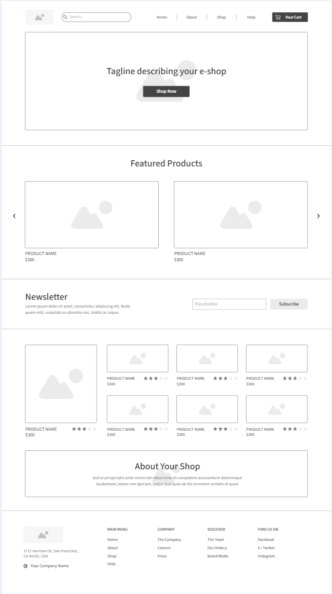

# CSS Styling Project

## Description
This project focuses on applying CSS styles to a wireframe. Additionally, it includes results from two known CSS games: **CSS Plate** and **CSS Froggy**.

## Task: Apply CSS Styles

### Objective
- Apply CSS styles to a given wireframe to improve its appearance and usability.

### Wireframe
Here is the wireframe we are starting with:

## Live Demo
Check out the live demo of the project [here](https://nedaa2024.github.io/Task01-web/).

## Game Results
Here are the screenshots of my results from the CSS games:

### CSS Plate

### CSS Froggy

## Try the Games Yourself
- [CSS Plate](https://cssplate.com)
- [CSS Froggy](https://cssfroggy.com)

## Usage
- Clone the repository and open the `index.html` file in your browser to view the implementation.
- Adjust the styles in `styles.css` to see the changes.

### Contact
- **Email**: nedaaalyasein@gmail.com
- **GitHub**: [Your GitHub Profile](https://github.com/nedaa2024)

---

Thank you for visiting this project! Feel free to contribute or provide feedback.
